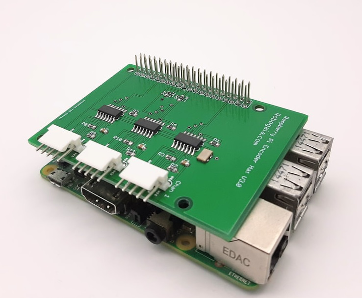

# Raspberry_Pi_Encoder_Hat_3_Channel

This is the code for Raspberry Pi 3 Channel Encoder Hat. here is the link:

https://www.robogaia.com/raspberry-pi-3-channel-encoder-hat.html

To run the code use:

python ./Test_3_chan_encoder_plate.py
